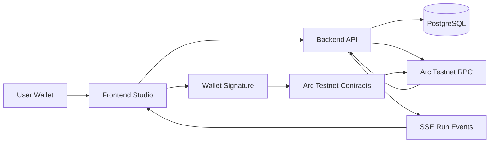

# Archestra

Archestra is a DeFi workflow studio for composing, simulating, and running on-chain strategies on Arc Testnet. It combines a visual workflow editor, a backend API/indexer, and Solidity contracts that execute strategy steps through user-owned vaults.

## What It Does

Archestra lets a user:

- Connect a wallet to Arc Testnet.
- Pick a strategy template or compose blocks on a canvas.
- Create a workflow on-chain through `WorkflowRegistry`.
- Open spending sessions for a vault.
- Fund the vault with demo tokens.
- Simulate and run a strategy.
- Watch workflow progress through indexed events and SSE.

## Repository Layout

| Path | Purpose |
|---|---|
| `frontend/` | Next.js studio, wallet UI, canvas editor, Arc Testnet interaction layer |
| `backend/` | Hono API, PostgreSQL persistence, workflow CRUD, assistant, Arc indexer/calldata builder |
| `contracts/` | Foundry Solidity contracts, adapters, deployment scripts, exported ABIs and addresses |
| `docs/` | Project progress, integration plans, runbooks, and handoff notes |
| `plan/` | Planning and handoff documents shared across teams |

## Architecture



## Components

### Frontend

- Next.js 16, React 19, TypeScript.
- Wallet integration with RainbowKit, wagmi, and viem.
- Visual workflow canvas with templates and block configuration.
- Reads vault/session/token state from Arc Testnet.
- Current status: frontend can call contracts directly; backend-mediated integration is planned.

### Backend

- Hono HTTP API on Node.js 22.
- PostgreSQL + Drizzle ORM.
- Zod schemas, strict TypeScript, Biome, Vitest.
- Mock and Arc chain adapters.
- OpenAPI JSON + Scalar docs at `/v1/docs`.
- Current status: Arc mode is locally verified for on-chain reads, run calldata generation, txHash attachment, and receipt watcher pipeline.

### Contracts

- Foundry project, Solidity 0.8.26.
- `WorkflowRegistry`, `StrategyVault`, `VaultFactory`, `Executor`, and step adapters.
- Deployed on Arc Testnet.
- Contract exports are under `contracts/exports/`.
- Current blocker: `MockAggregator`/price feed is not deployed, so `condition` blocks cannot run end-to-end yet.

## Arc Testnet

| Field | Value |
|---|---|
| Chain ID | `5042002` |
| RPC | `https://rpc.testnet.arc.io` |
| Registry | `0x88d8Cd3009cd7905ec0E7f895c772Edd9878b42F` |
| Backend default port | `8787` |
| Frontend default port | `3000` |

## Quick Start

For full setup, wallet walkthrough, troubleshooting, and demo checklist, see [`docs/run-and-user-guide.md`](./docs/run-and-user-guide.md).

### Backend

```bash
cd backend
pnpm install
cp .env.example .env
pnpm build
node --env-file=.env dist/db/migrate.js
node --env-file=.env dist/db/seed.js
pnpm start
```

Backend runs at `http://localhost:8787`.

API docs:

```text
http://localhost:8787/v1/docs
```

### Frontend

```bash
cd frontend
pnpm install --config.minimumReleaseAge=0
node_modules/.bin/next.cmd dev
```

Frontend runs at `http://localhost:3000`.

If Arc RPC is rate-limited, create `frontend/.env.local`:

```env
NEXT_PUBLIC_ARC_RPC_URL=https://rpc.blockdaemon.testnet.arc.network
```

Alternative fallback: `https://arc-testnet.drpc.org`.

### Contracts

```bash
cd contracts
forge build
forge test
```

Contract exports used by frontend/backend:

```text
contracts/exports/abi/*.json
contracts/exports/addresses.arc-testnet.json
```

## Backend Modes

The backend supports two chain adapter modes:

```env
CHAIN_ADAPTER=mock
```

Mock mode runs step-by-step in memory and is useful for demos without a wallet.

```env
CHAIN_ADAPTER=arc
RPC_URL=https://rpc.testnet.arc.io
CHAIN_ID=5042002
REGISTRY_ADDRESS=0x88d8Cd3009cd7905ec0E7f895c772Edd9878b42F
```

Arc mode builds wallet calldata and indexes receipts after the frontend reports a tx hash.

## Key API Endpoints

| Method | Path | Purpose |
|---|---|---|
| GET | `/v1/health` | Health check |
| GET | `/v1/blocks` | Block catalog |
| GET | `/v1/templates` | Strategy templates |
| POST | `/v1/workflows` | Create workflow |
| PATCH | `/v1/workflows/:id` | Update workflow, including `onchainId` |
| POST | `/v1/workflows/:id/simulate` | Simulate workflow |
| POST | `/v1/workflows/:id/runs` | Build run calldata / start mock run |
| POST | `/v1/runs/:id/tx` | Attach txHash and start receipt watcher |
| GET | `/v1/runs/:id/events` | SSE run event stream |
| GET | `/v1/onchain/summary?address=0x...` | Vault/session/executor summary |
| GET | `/v1/docs` | Scalar API docs |

Most non-public backend routes require:

```http
x-owner-id: <owner-id>
```

## Current Integration Status

| Integration | Status |
|---|---|
| Frontend → Contracts | Working |
| Backend → Contracts reads | Working locally |
| Backend run calldata generation | Working locally |
| Backend txHash receipt watcher | Pipeline verified with fixture tx |
| Frontend → Backend chain flow | Pending |
| Full live wallet run indexed by backend | Pending |

## Important Docs

- `docs/backend-progress.md` — detailed backend progress log.
- `docs/backend-next-steps.md` — backend-specific task roadmap.
- `docs/project-integration-next-steps.md` — cross-project integration roadmap.
- `docs/frontend-onchain-findings.md` — frontend on-chain debugging findings and merge guidance.
- `docs/run-and-user-guide.md` — how to run the stack and use it as a user.
- `docs/plan/report/report.md` — frontend Arc integration report.

## Known Issues

- Arc RPC endpoints can rate-limit. Prefer fallback RPCs during demos.
- `condition` blocks need a deployed price feed / `MockAggregator`.
- Backend receipt watcher is currently in-memory and should be made persistent before production.
- Backend authentication is currently `x-owner-id`; production should use wallet signature auth (SIWE or equivalent).

## License

Hackathon project. License TBD.
